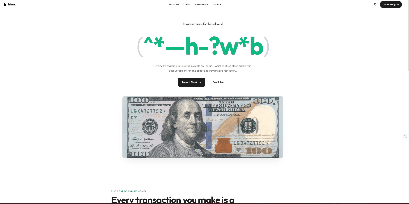
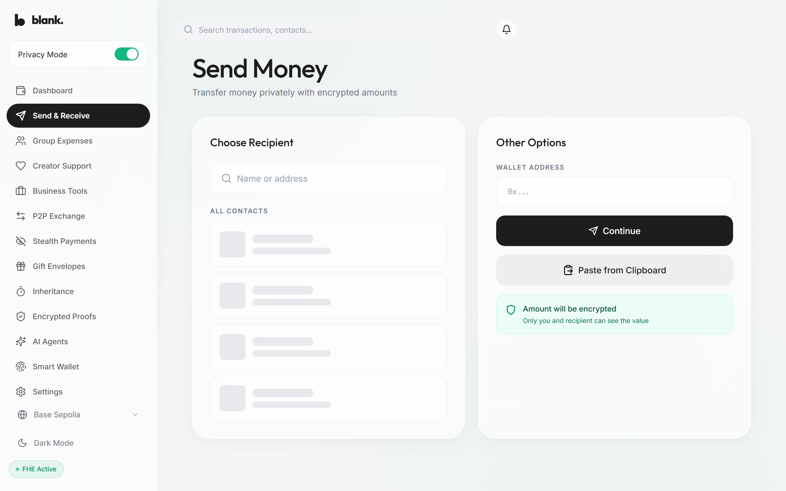
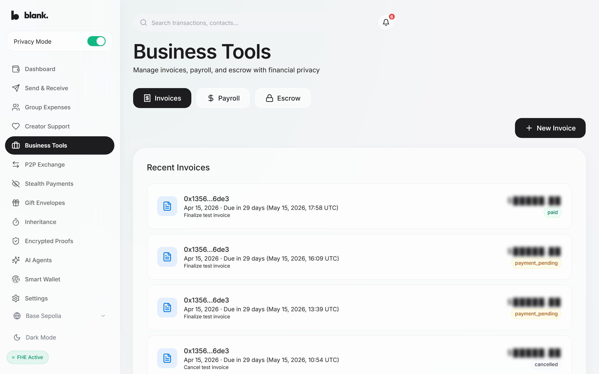
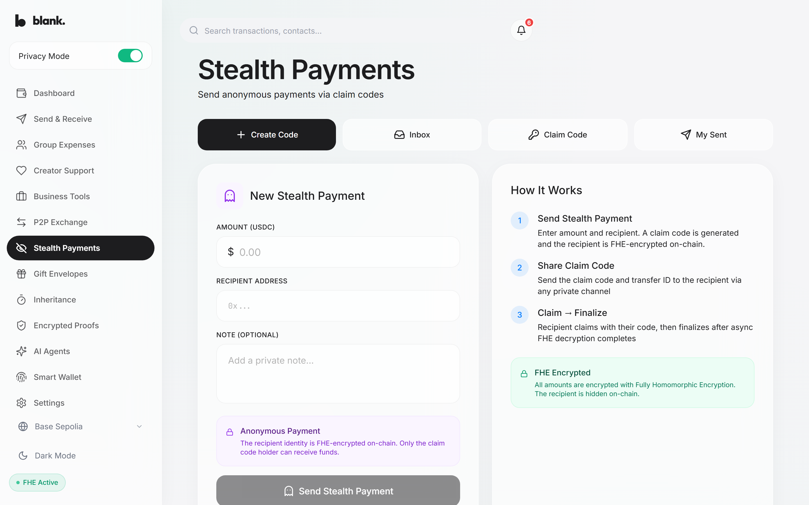
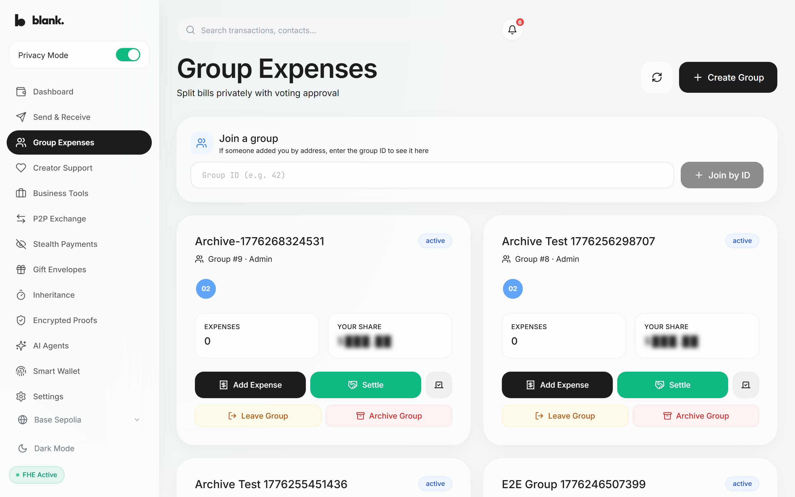

<div align="center">


<br /><br />

# Blank

### Your salary is your business. Not the blockchain's.

Blank is an encrypted payment platform where transaction amounts are invisible on-chain.
Built on Fully Homomorphic Encryption — the blockchain processes your money without ever seeing the numbers.

<br />

[**Launch App**](https://blank-omega-jade.vercel.app) &nbsp; | &nbsp; [**See It Live**](https://blank-omega-jade.vercel.app/live)

<br />



</div>

---

## The Problem

Every payment on a public blockchain is a postcard — amount, sender, receiver, all visible to anyone with a block explorer.

- Employees can see each other's salaries
- Competitors can map your supply chain from payment flows
- High-balance wallets become targets for physical attacks
- MEV bots front-run visible swap amounts

Financial privacy isn't a feature request. It's missing infrastructure.

## The Solution

Blank encrypts every transaction amount using **Fully Homomorphic Encryption** before it reaches the chain. Smart contracts add, compare, and transfer encrypted values. The plaintext never exists on-chain.

```
You send $250         →  Encrypted in your browser (TFHE ciphertext + ZK proof)
Smart contract runs   →  FHE.add(balance, amount) — operates on ciphertext
Recipient receives    →  Decrypts with their key → sees $250
Everyone else sees    →  $████.██
```

No trusted intermediary. No hardware enclaves. No MPC committees. Pure math.

---

## What's New in Wave 2 (April 2026)

This wave we migrated the whole app from Fhenix's older testnet to CoFHE v0.4, added passkey smart wallets, and made the app run on Base Sepolia and Ethereum Sepolia off one codebase.

### CoFHE v0.4 Migration
- **Sixteen contracts moved over**: Every hub (PaymentHub, BusinessHub, GroupManager, StealthPayments, P2PExchange, InheritanceManager, CreatorHub, PaymentReceipts, and others) was ported to the `@fhenixprotocol/cofhe-contracts` v0.4 API with no state migration — UUPS proxies upgraded in place. The piece that took the longest was `transferFromVerified`: hubs verify an encrypted input in their own `msg.sender` context, then pass the verified handle to the vault. Without that, cross-contract FHE signature checks fail silently, and nothing tells you why.
- **Twenty-eight FHE operations rewritten**: `FHE.asEuint`, `FHE.add`, `FHE.select`, and the four-tier ACL (`allowThis`, `allowSender`, `allow`, `allowTransient`) now follow the v0.4 handle model.

### Passkey Smart Wallets
- **ERC-4337 accounts signed by P-256 passkeys**: Sign up with a passphrase — no browser extension, no MetaMask. The app creates a smart account and signs UserOps with WebAuthn.
- **Paymaster-sponsored gas**: BlankPaymaster pays for passkey users' first-time account deployment, approvals, and payments. Gas is free to the sender on testnet.
- **Shared hook with MetaMask path**: Both wallet paths go through `useUnifiedWrite`, so we are not maintaining two versions of the app.

### Dual-Chain
- **Base Sepolia and Ethereum Sepolia on one codebase**: Same contracts deployed on both chains. Chain switch is a UI affordance, not a separate build.
- **Per-chain activity + explorer links**: Activity feeds show each transaction on the chain it actually happened on, not the viewer's active chain. Explorer links route to the right network.

### AI Agent Payments
- **Kimi K2 parses plain English into an amount**: The server runs the model (Claude as backup), derives an amount, and signs it with an agent private key.
- **On-chain ecrecover**: PaymentHub verifies the signature and ties every agent-authored payment back to the agent that signed it. The private key never leaves the server. Signatures expire in ten minutes so replays cannot work.

### Verifiable Balance Proofs
- **Shareable proof URLs**: A user generates a proof that their balance is above some number and gets a link they can share. Anyone without a wallet can open it, click verify, and the Threshold Network's decrypted answer is published on-chain with a signature check.
- **No trusted backend**: The contract does the math. Nobody has to trust our server for the answer.

---

## Product

<table>
<tr>
<td width="50%" valign="top">

### Encrypted Payments

Send money where only sender and recipient can see the amount. Supports contacts, QR codes, payment links, and batch transfers to up to 30 recipients.



</td>
<td width="50%" valign="top">

### Business Tools

Encrypted invoicing with two-phase verification, confidential batch payroll where employees can't see each other's pay, and escrow with optional arbiter for disputes.



</td>
</tr>
<tr>
<td width="50%" valign="top">

### Stealth Payments

Send anonymous payments via one-time claim codes. The recipient's identity is FHE-encrypted on-chain — only the claim code holder can receive funds. 30-day refund window if unclaimed.



</td>
<td width="50%" valign="top">

### Group Expenses & Gifts

Split bills with encrypted amounts. Resolve disputes with quadratic voting. Send encrypted gift envelopes to multiple recipients with equal or random splits and expiry dates.



</td>
</tr>
</table>

## Wallet Support

Blank supports two wallet paths — no compromise on either:

| | Passkey Wallet | MetaMask / EOA |
|---|---|---|
| **Setup** | Create with just a passphrase — no extension | Connect any browser wallet |
| **Signing** | P-256 passkey (WebAuthn) | Standard ECDSA |
| **Gas** | Free — sponsored via Paymaster | User pays |
| **Transactions** | Batched into single UserOp (ERC-4337) | One MetaMask popup per operation |
| **Best for** | New users, mobile, passwordless UX | Existing crypto users |

Both paths use the same encrypted contracts and the same UI.

### All Features

| Category | Features |
|----------|----------|
| **Payments** | Encrypted P2P transfers, payment requests (create/fulfill/cancel), batch send, QR codes, payment links |
| **Business** | Encrypted invoicing with 2-phase verification, confidential payroll, escrow with arbiter disputes |
| **Social** | Group expense splitting, quadratic voting, creator tips with tier badges, gift envelopes |
| **Privacy** | Stealth payments via claim codes, shield/unshield between plaintext and encrypted vaults |
| **Proofs** | Qualification proofs — prove "income above $X" without revealing the actual number |
| **Infrastructure** | Dead man's switch inheritance, P2P exchange with encrypted settlement, AI agent payments |

---

## How It Works

```
┌─────────────────┐     ┌──────────────────┐     ┌─────────────────────┐
│  Your Browser    │     │  Fhenix CoFHE    │     │  Base Sepolia       │
│                  │     │  Threshold Net    │     │  Smart Contracts    │
│  1. Enter $250   │     │                  │     │                     │
│  2. TFHE encrypt │────►│  3. ZK verify    │     │                     │
│     in WebWorker │     │  4. ECDSA sign   │────►│  5. ecrecover       │
│                  │     │                  │     │  6. FHE.add()       │
│                  │     │                  │     │  7. Store ciphertext│
│                  │◄────│                  │◄────│                     │
│  8. Recipient    │     │  Async decrypt   │     │  Permit-gated       │
│     sees $250    │     │  via permits     │     │  access control     │
└─────────────────┘     └──────────────────┘     └─────────────────────┘
```

1. **Client-side encryption** — Plaintext never leaves your browser. TFHE WASM runs in a Web Worker.
2. **Zero-knowledge verification** — CoFHE threshold network validates the proof and signs it.
3. **On-chain computation** — Smart contracts operate on ciphertext using FHE operations (add, compare, select).
4. **Permit-based decryption** — Only authorized parties can decrypt values via the threshold network.

---

## Deployed Contracts

All contracts are UUPS-upgradeable proxies, live on **Base Sepolia** (84532) and **Ethereum Sepolia** (11155111).

| Contract | Base Sepolia | Purpose |
|----------|-------------|---------|
| FHERC20Vault | `0x789f0bC4...B0ff23` | Encrypted token vault — shield, unshield, transfer |
| PaymentHub | `0xF420102D...e831` | P2P payments, requests, batch send |
| BusinessHub | `0xEfD67E33...EFD` | Invoicing, payroll, escrow |
| GroupManager | `0x1749E0E0...9D3d` | Group expenses, quadratic voting |
| StealthPayments | `0x76aDF6D8...F1C` | Anonymous transfers via claim codes |
| GiftMoney | `0x3737448...cDDf` | Gift envelopes with expiry |
| P2PExchange | `0xDa60609...f116` | Atomic swaps with encrypted settlement |
| CreatorHub | `0x5dc3686...12ea` | Creator tips with tier badges |
| InheritanceManager | `0x289714c...3d5` | Dead man's switch |
| PaymentReceipts | `0x23f0530...AD7c` | Qualification proofs |
| BlankAccountFactory | `0xd19Bfd9...16fb` | ERC-4337 smart wallet factory |
| BlankPaymaster | `0xB1CbBD5...63de` | Gas sponsorship for passkey users |

---

## Security

| Layer | Approach |
|-------|----------|
| **Privacy** | `FHE.select()` over `require()` — a revert leaks 1 bit of information. Enough reverts reconstruct a balance. Blank never reverts on insufficient funds. |
| **Encryption** | Every encrypted input is ZK-verified and signed by the CoFHE threshold network before on-chain use |
| **Access Control** | 4-tier FHE permit system: `allowThis` → `allowSender` → `allow` → `allowTransient` |
| **Contracts** | Reentrancy guards on all state-changing functions. UUPS upgradeable without state migration. |
| **Stealth** | Claim codes bound to `keccak256(code, claimer)` — intercepting the code is useless without the claimer's address |
| **Frontend** | Input validation on all addresses, empty-string guards on all `parseUnits` calls, toast feedback on every error |

---

## Tech Stack

| Layer | Technology |
|-------|-----------|
| **Chains** | Base Sepolia (84532) + Ethereum Sepolia (11155111) |
| **Contracts** | Solidity 0.8.25, UUPS proxies, @fhenixprotocol/cofhe-contracts |
| **FHE** | Fhenix CoFHE SDK (@cofhe/sdk v0.4.0), TFHE WASM, threshold decryption |
| **Account Abstraction** | ERC-4337, P-256 passkey signing, EntryPoint v0.7 |
| **Frontend** | React, Vite, TypeScript, Tailwind CSS |
| **Wallet** | wagmi + viem (MetaMask, Coinbase Wallet, WalletConnect) |
| **Realtime** | Supabase (notifications + activity feed, NOT source of truth) |
| **Deployment** | Vercel (frontend), Hardhat (contracts) |

---

## Getting Started

**Use the app** — no setup required:

Visit [**blank-omega-jade.vercel.app**](https://blank-omega-jade.vercel.app), create a passkey wallet with any passphrase, and you're in. Gas is free.

**Run locally:**

```bash
git clone https://github.com/Pratiikpy/Blank.git
cd Blank && pnpm install

# Frontend
cd packages/app
cp .env.example .env
pnpm dev                # http://localhost:3000

# Contracts
cd packages/contracts
cp .env.example .env
npx hardhat compile
npx hardhat test
```

---

## Coming in Wave 3

Next wave we want to take Blank from "runs on testnet" to something a small group of users actually uses. That probably means narrowing the app rather than shipping more features picking one audience (likely freelancers invoicing clients), cutting anything that doesn't serve them, and using it ourselves before calling it a real product. The gap is not the tech.

Smaller things we want to land alongside: claimable payment links so you can send money by URL without knowing the recipient's address, contact nicknames instead of copy-pasted hex, and search over transaction notes. No promises on timing.

---

## License

MIT
